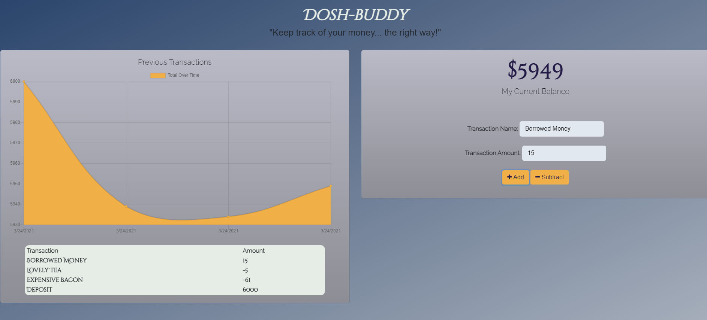

  <h1 align="center">Budget-o-matic</h1>
   
   
##  Table of contents

[Description / Features](#description)

[Installation](#installation)

[Usage](#usage)

[Contributors](#contributors)

[Tests](#test)

[Contact information](#contact)

  #  Description / Features
   Tracks the user's budget, both online, and offline.

  #  Installation
   Simply download the zip, or simply run the app through the provided heroku app. (...)
  
  #  Usage
   simply run the app through the provided heroku app. (...)
  
  # Sceenshot
  
  
  
  
  # License
  
   

  This application is covered by the Open license. 
  
  Users are (hopefully) expected to follow this lisense guidelines, or else they shalt be smitten with the wrath of my dissapointment.

  #  Contributors
   None
  
  #  Tests
  No tests
   
  
  #  Contact information
  GitHub: [relten98](https://github.com/relten98)
   
   
  Have any questions? feel free to email at: diezhandinoty@gmail.com
      
